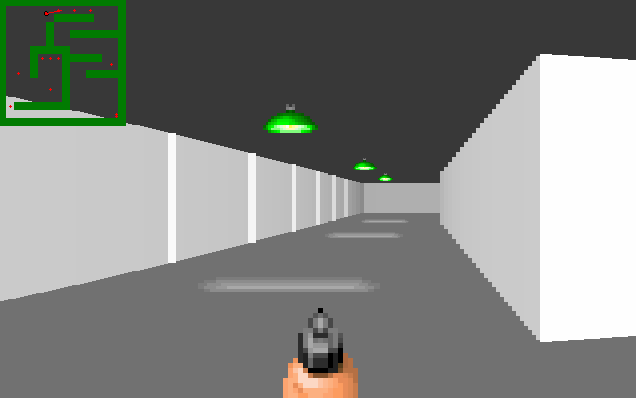

# 2.5D RayCasting Game
This is a simple pseudo-3d walker.

The work of this program can be described in one screenshot:

#### Control with Mouse and Keyboard:
 * W, UpArrow - forward
 * S, DownArrow - backwards
 * A - left
 * D - right
 * LeftArrow - turn left
 * RightArrow - turn right
 * ESC - Exit dialog

Mouse control may be incorrect, so I recommend using the arrow-keys.
